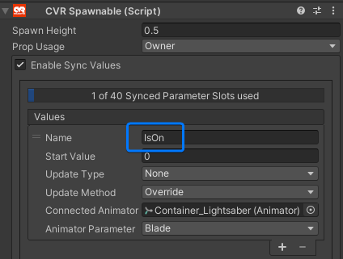

# OSC

This **Melon Loader** mod allows you to use OSC to interact with **ChilloutVR**. It tries to be compatible with other social VR 
games that also use OSC. This way allows the usage of tools made for other games with relative ease.

- [OSC Avatar](#OSC-Avatar)
- [OSC Inputs](#OSC-Inputs)
- [OSC Props](#OSC-Props)
- [OSC Tracking](#OSC-Tracking)
- [Avatar Json Configurations](#Avatar-Json-Configurations)
- [OSC Config](#OSC-Config)
- [Debugging](#Debugging)
- [Configuration](#General-Configuration)


For now there are 6 categories of endpoints you can use:
- [OSC Avatar](#OSC-Avatar) for listening/triggering avatar changes, and also their parameters
- [OSC Inputs](#OSC-Inputs) for triggering inputs/actions.
- [OSC Props](#OSC-Props) for interacting with props.
- [OSC Tracking](#OSC-Tracking) to fetch tracking information (headset, controllers, trackers, play space).
- [OSC Config](#OSC-Config) configuration/utilities via OSC.


## Intro

This is a long read ;_; Before you get discouraged if you only want to slap a mod that enables OSC just slap the mod in
and it should work. And if all you want is to have it react to OSC messages you can turn on the `Performance Mode` in 
the configuration. This will make it so the mod won't send OSC messages out with the tracking data etc, and I'd say that
would be a decent basic setup.

If you are interested in listening to events from the mod then you're in for a great time! As this allows to do a lot of
fun things.

### Easy API
I have encapsulated this API into a [python library](https://github.com/kafeijao/cvr_osc_lib_py) with some examples, and
you won't need to worry about endpoints, parameters OSC server/client, as everything is done with dataclasses and 
methods to send and receive info. I will maintaining the library updated with the mod! The examples are especially
interesting.


---

## OSC Avatar

The first module is the avatar module, where you are able to interface with avatar related stuff. You can
change the current avatar you're using via OSC, and also listen to those changes (you'll get the event either way).

Also you're able to change and listen to the avatar parameters. This part part has a lot of customization options
because you're able to change the addresses and types via a config (not required).

---

### OSC Avatar Change
Whenever you load into an avatar the mod will send a message to `/avatar/change` containing as the first and only
argument a string representing the avatar UUID.

#### Address
```/avatar/change```

**Mod will send:**
#### Arguments
- `arg#1` - Avatar GUID [*string*]
- `arg#2` - Path to the avatar json config [*string*], this is new to this mod, but as it is an additional param it 
won't break existing osc apps

**Mod will receive:**
#### Arguments
- `arg#1` - Avatar GUID [*string*]

**New:** The mod will also listen to the address `/avatar/change`, so if you send a UUID of an avatar (that you have 
permission to use), it will change your avatar in-game. This is `enabled` by default, but you can go to the 
configurations and disable it.

---

## OSC Avatar Parameters
You can listen and trigger parameter changes on your avatar via OSC messages, by default the endpoint to change and 
listen to parameter changes as follow.

#### Address [`deprecated`]
```/avatar/parameters/<parameter_name>```

Where `<parameter_name>` would be the name of your parameter. *The parameter name is case sensitive!*

#### Arguments [`deprecated`]
- `arg#1` - Parameter value [ *float *|* int *|* bool | null* ], for triggers you can ignore sending a parameter, the
value will be ignored either way.


These are certain limitations using the endpoint above, because according to the OSC spec you can't have `#` in the
last member of the OSC address. So some OSC clients will have issues setting local parameters (because in cvr they
require a `#`). I had to hack my way to force my client to allow `#` on the address ;_;

I marked it as deprecated but will still support it for compatibility reasons. Use the alternative ones bellow if you're
implementing something new (please).

As for sending I'll be sending on both endpoints so just pick one to listen to.


#### Address [`preferred`]
```/avatar/parameter```

#### Arguments [`preferred`]
- `arg#1` - Parameter value [ *float *|* int *|* bool | null* ], for triggers you can ignore sending a parameter, the
value will be ignored either way.
- `arg#2` - Parameter name [ *string* ], *The parameter name is case sensitive!*


The Parameter value argument should be sent as the same type as the parameter is defined in the animator. But you can 
also send as a `string` or some other type that has a conversion implied.

**Note:** Sending the correct type will require less code to run, making it more performant.

We support all animator parameter types, `Float`, `Int`, `Bool`, and `Trigger`([*](#Triggers))

You can listen for **All** the parameters changes present in the animator!

As for sending parameter you can send parameter changes for all present in the animator **Except** for the **core
parameters**. Those are the default parameters CVR modifies for you, Like `GestureRight`, `MovementX`, `Emote`, etc), 
and since they are set every frame we can't change them in this endpoint.

If you wish to change those, check the [OSC Inputs](#OSC-Inputs) section, as
it allows you to control the input that drives those parameters, for example setting the Input `GestureRight`
(using [OSC Inputs](#OSC-Inputs)) to Open Hand will make the game then change the parameter `Gesture Right` to `-1`.

### Triggers
We support the parameter type `Trigger`, but it needs to be enabled in the configuration as it may break some existing
apps. It uses the same parameter change address, but it sends just the address without any value.

And when listening
the same thing, you will receive an OSC message to the parameter address, but there won't be a value.


---

## OSC Inputs

Here is where you can interact with the game in a more generic ways, allow you to send controller inputs or triggering
actions in the game.

#### Address
```/input/<input_name>```

Where the `<input_name>` is the actual name of the input you're trying to change.

#### Arguments
- `arg#1` - Input value [ *float* | *int* | *bool* ]

There are some inputs that are not present that exist in other VR Social platforms, this is due CVR not having those
features implemented yet. Like rotating the object you're holding with keyboard inputs. And some others that are new,
and I'll be making them as [*new*] while listing them.

**Note:** The inputs will stick with the latest value you send, so lets say if you send `/input/Jump` with the value `1`
will act the same as you holding down the key to Jump, and it will only be released when you send `/input/Jump` with the
value `0`. So don't forget to reset them in your apps, otherwise you might end up jumping forever.

There are 3 types of Inputs:
- [Axes](#OSC-Inputs-Axes)
- [Buttons](#OSC-Inputs-Buttons)
- [Values](#OSC-Inputs-Values)

---

### OSC Inputs Axes
Axes expecting a `float` value that ranges between `-1`/`0` and `1`. They are namely used for things that require a 
range of values instead of a on/off, for example the Movement, where `Horizontal` can be set to `-0.5` which would be
the same as having the thumbstick on your controller to the left (because it's a negative value) but only halfway 
(because it's -0.5, -1 would be all the way to the left).

- `/intput/Horizontal` - Move your avatar right `1` or left `-1`
- `/intput/Vertical` - Move your avatar forward `1` or backwards `-1`
- `/intput/LookHorizontal` - Look right `1` or left `-1`
- `/intput/MoveHoldFB` - Move a held object forwards `1` and backwards `-1`
- `/intput/LookVertical` - [*new*] Look up `1` or down `-1`
- `/intput/GripLeftValue` - [*new*] Left hand trigger grip released `0` or pulled to max `1`
- `/intput/GripRightValue` - [*new*] Right hand trigger grip released `0` or pulled to max `1`


### OSC Inputs Buttons
Buttons are expecting `boolean` values, which can be represented by the boolean types `true` for button
pressed and `false` for released. You can also send `integers` with the values `1` for pressed and `0` for released.

**Note1:** Don't forget to release the buttons, as it will prevent you from sending the press event again.

**Note2:** Some inputs will keep triggering the value to the input (when it says `while true/1`) and others will trigger
just once (when it says `when true/1`). This is referring to the little description on each input on the next section.

#### Movement and look:
- `/intput/MoveForward` - Move forward **while** `true`/`1`
- `/intput/MoveBackward` - Move backwards **while** `true`/`1`
- `/intput/MoveLeft` - Move left **while** `true`/`1`
- `/intput/MoveRight` - Move right **while** `true`/`1`
- `/intput/LookLeft` - Look left **while** `true`/`1`
- `/intput/LookRight` - Look right **while** `true`/`1`
- `/intput/ComfortLeft` - Look left **while** `true`/`1`
- `/intput/ComfortRight` - Look right **while** `true`/`1`

#### Held Objects Interactions:
- `/intput/DropRight` - **Drops** currently held object on the right hand **when** `true`/`1`
- `/intput/UseRight` - **Uses** currently held object on the right hand **when** `true`/`1`
- `/intput/GrabRight` - **Grabs** currently object targeted by right hand (or crosshair in desktop) **when** `true`/`1`
- `/intput/DropLeft` - **Drops** currently held object on the left hand **when** `true`/`1`
- `/intput/UseLeft` - **Uses** currently held object on the left hand **when** `true`/`1`
- `/intput/GrabLeft` - **Grabs** currently object targeted by left hand (doesn't work in desktop) **when** `true`/`1`

#### Actions:
- `/intput/Jump` - Jump **while** `true`/`1`
- `/intput/Run` - Run **while** `true`/`1`
- `/intput/PanicButton` - Disables all avatars and props **when** `true`/`1` (might require to reloading the instance to revert)
- `/intput/QuickMenuToggleLeft` - Toggles the quick menu **when** `true`/`1`
- `/intput/QuickMenuToggleRight` - Toggles the big menu **when** `true`/`1`
- `/intput/Voice` - Toggles the local mute setting **when** `true`/`1`

#### Special Actions [*new*]:
- `/intput/Crouch` - Toggles crouch **when** `true`/`1`
- `/intput/Prone` - Toggles prone **when** `true`/`1`
- `/intput/IndependentHeadTurn` - Enables being able to look around without moving the body **while** `true`/`1`
- `/intput/Zoom` - Enables zoom **while** `true`/`1`
- `/intput/Reload` - Reloads the UI **when** `true`/`1` [*Blacklisted by default*]
- `/intput/ToggleNameplates` - Toggles nameplates **when** `true`/`1`
- `/intput/ToggleHUD` - Toggles the HUD **when** `true`/`1`
- `/intput/ToggleFlightMode` - Toggles flight mode **when** `true`/`1`
- `/intput/Respawn` - Respawns **when** `true`/`1` [*Blacklisted by default*]
- `/intput/ToggleCamera` - Toggles camera **when** `true`/`1`
- `/intput/ToggleSeated` - Toggles seated mode **when** `true`/`1`
- `/intput/QuitGame` - Closes the game **when** `true`/`1` [*Blacklisted by default*]

#### Configuration
You can have certain inputs blacklisted, as some can be very annoying. By default the `Reload`, `Respawn`, and `QuitGame`
are on the blacklist (`Reload` at the time of writing was bugged and would crash your game (same as spamming `F5`)).
You can also disable the whole input module on the configuration as well.

---

### OSC Inputs Values
Values are similar to `Axes` but removes the restriction of being between `-1` and `1`, they are used to send values to
certain properties of the game. The values are of the type `float` or `int` and their range is dependent on each entry.

**Note:** Most of these default to the value 0, but there are exceptions. As the other inputs you need to reset to the
default value otherwise they will remain the last value you sent.

- `/intput/Emote` - Sets which emote to play when settings the value. Default: `-1`
- `/intput/GestureLeft` - Sets which gesture to perform on the left hand. Default: `0`
- `/intput/GestureRight` - Sets which gesture to perform on the right hand. Default: `0`
- `/intput/Toggle` - Sets which toggle is active. Default: `0`


---

## OSC Props

This mod module allows to interact with props. I've purposely added limitations to some interactions with props, you can
check these on bellow. These limitations exist to prevent both abuse and some weird behavior that might happen. 

All props require the Prop GUID in their address (*<prop_guid>*): `1aa10cac-36ba-4e01-b58d-a76dc35f61bb`
This value can be known before hand, as it's the same guid that gets assigned when you upload something.

Some props require the Prop instance ID in their address (*<prop_instance_id>*): `8E143EA45EE8`
This value is a string with 12 characters corresponding to a Hexadecimal value. This value is created when you spawn a
prop in an instance, and the best way to obtain it is by listening to the `Create` and `Availability` addresses.

---

### OSC Props Create
You're able to spawn props by providing their GUID. Keep in mind that you can only spawn props you
have access to and there is a limit of 20 props spawned by yourself.

You can also listen for prop spawn events, which you can use to grab the instance IDs of said props.

#### Address

Here we have two addresses, when you want to create a prop you don't include an instance ID, but when you receive the
information a prop was created, it will come with the instance ID on the address

```/prop/create```

#### Arguments
The address is the same, but the parameters will be different depending whether you are listening for spawn events, or
you're sending messages to spawn props.

**Mod will send:**
- `arg#1` - Prop GUID [*string*]
- `arg#2` - Instance ID of the prop spawned [*string*]
- `arg#3` - Count of sub-sync transforms [*int*], if count = 1 it means you can send location_sub to the index = 0

**Mod is expecting to receive**
- `arg#1` - Prop GUID [*string*]
- `arg#2` - local position x [*Optional*] [*float*]
- `arg#3` - local position y [*Optional*] [*float*]
- `arg#4` - local position z [*Optional*] [*float*]

Those local position arguments are optional, they define where the prop should be spawned in relation to your play 
space. If you want to provide a value, you need to provide all of them. If no values are provided they'll default to 0.

---

### OSC Props Delete
As the name suggests you can delete props that you've spawned. You can do so by providing the GUID of the prop as well
as their instance ID to uniquely identify them.

You can also listen for prop deletion events, which you can use to know that a certain prop instance stopped exising and
won't become available for interaction anymore.

#### Address
```/prop/delete```

#### Arguments
- `arg#1` - Prop GUID [*string*]
- `arg#2` - Instance ID of the prop spawned [*string*]

---

### OSC Props Availability
This address will be called every time a prop has their availability changed. What what I mean by availability is
where you are able to control or not this prop. The props become available when no remote player is *grabbing*, 
*telegrabbing*, nor has it *attached* to themselves. Also this **only** affects props spawned by yourself!

The only exception is it will say it is available but you won't be able to set the location if you (the local player)
is *grabbing*, *telegrabbing*, or has it *attached*.

Obviously this is an address set by the game, so you can't send osc messages to try to change it.

#### Address
```/prop/available```

#### Arguments
- `arg#1` - Prop GUID [*string*]
- `arg#2` - Instance ID of the prop spawned [*string*]
- `arg#3` - Whether the prop interactions are available `true`, or not `false` [*bool*]

---

### OSC Props Parameters
Here you will be able to listen and write to the prop's synced parameters. You will need to provide the GUID of the prop
and it's instance ID to do so.

#### Limitations
- You need to be the player that spawned the prop.
- The prop **not** being controlled by a remote player [*grabbed* | *telegrabbed* | *attached*]

#### Address
```/prop/parameter```

#### Arguments

- `arg#1` - Prop GUID [*string*]
- `arg#2` - Instance ID of the prop spawned [*string*]
- `arg#3` - Sync parameter name (*read note bellow*) [*string*]
- `arg#4` - Value to be set on the sync parameter [*float*]

Note: the Sync parameter name **is** the name you defined in the CVR Spawnable Component, and **not**
the actual name of parameter inside of the animator. This name is **case sensitive**.



---

### OSC Props Location
You are also able to listen and set the location of a prop. This is very powerful as you can for example link the
tracking data you receive form the tracking module to a prop so it's controlled by the tracker.

**Note**: If you disable the Tracking Module, it will also disable the updates of the Props Location. You can still set
their positions without any issue tho.

#### Limitations
- You need to be the player that spawned the prop.
- The prop **not** being controlled by **any** player (both remote and local) [*grabbed* | *telegrabbed* | *attached*]

#### Address
```/prop/location```

#### Arguments
- `arg#1` - Prop GUID [*string*]
- `arg#2` - Instance ID of the prop spawned [*string*]
- `arg#3` - position.x [*float*]
- `arg#4` - position.y [*float*]
- `arg#5` - position.z [*float*]
- `arg#6` - rotation.x [*float*]
- `arg#7` - rotation.y [*float*]
- `arg#8` - rotation.z [*float*]

---

### OSC Props Location Sub
You are also able to listen and set the location of a prop's sub-sync transforms. This is very powerful as you can for
example link the tracking data you receive form the tracking module to a sub-sync so it's controlled by the tracker.

**Note**: If you disable the Tracking Module, it will also disable the updates of the Location Sub. You can still set
their positions without any issue tho.

#### Limitations
- You need to be the player that spawned the prop.
- The prop **not** being controlled by **any** player (both remote and local) [*grabbed* | *telegrabbed* | *attached*]

#### Address
```/prop/location_sub```

#### Arguments
- `arg#1` - Prop GUID [*string*]
- `arg#2` - Instance ID of the prop spawned [*string*]
- `arg#3` - Index of the prop sub-sync transform [*int*], starts from 0 and increments following the order set in the 
CVR Spawnable Component
- `arg#4` - position.x [*float*]
- `arg#5` - position.y [*float*]
- `arg#6` - position.z [*float*]
- `arg#7` - rotation.x [*float*]
- `arg#8` - rotation.y [*float*]
- `arg#9` - rotation.z [*float*]


---

## OSC Tracking

This mod module allows to read tracking data from the game namely from tracked devices, and the play space. You can
only listen to these, don't try messages to those (or else).

---

### OSC Tracking Play Space Data
The mod will keep sending the current play space position and rotation. This is especially useful if you want to create
avatar animations to drive the position of objects. Because the avatar origin is the play space origin. Meaning if you
have world space coordinates you want to make local to the avatar, you can do it by using the play space location data
to perform the calculations.

Both the position and rotation(euler angles) are in world space. And the address we're going to be sending is:

```/tracking/play_space```

The values are sent as `float` type arguments, and the values order is the following:
- `arg#1` - position.x [*float*]
- `arg#2` - position.y [*float*]
- `arg#3` - position.z [*float*]
- `arg#4` - rotation.x [*float*]
- `arg#5` - rotation.y [*float*]
- `arg#6` - rotation.z [*float*]

---

### OSC Tracking Device Status
You can listen here for steam vr device connected change status. Every device starts assuming it is disconnected so you
will always receive a connected = `True` as the first event from a device.

#### Address
```/tracking/device/status```

#### Arguments
- `arg#1` - Connected [*bool*], whether the device was connected `True` or disconnected `False`
- `arg#2` - Device type [*string*], Possible values: `hmd`, `base_station`, `left_controller`, `right_controller`, `tracker`, and
  `unknown`
- `arg#3` - Steam tracked index [*int*], given by SteamVR, it's unique for each device (*see note bellow*)
- `arg#4` - Device name [*string*], given by SteamVR, in some cases (like base stations) there is no name the string will be empty.

---

### OSC Tracking Devices Data
The mod also exposes the tracking information for tracked devices, like base stations, controllers, and trackers.

Both the position and rotation are for world space, and the rotation is sent in euler angles.

#### Address

```/tracking/device```

#### Arguments
- `arg#01` - Device type [*string*], Possible values: `hmd`, `base_station`, `left_controller`, `right_controller`, `tracker`, and
`unknown`
- `arg#02` - Steam tracked index [*int*], given by SteamVR, it's unique for each device (*see note bellow*)
- `arg#03` - Device name [*string*], given by SteamVR, in some cases (like base stations) there is no name the string will be empty.
- `arg#04` - Position.x [*float*]
- `arg#05` - Position.y [*float*]
- `arg#06` - Position.z [*float*]
- `arg#07` - Rotation.x [*float*]
- `arg#08` - Rotation.y [*float*]
- `arg#09` - Rotation.z [*float*]
- `#arg10` - Battery percentage [*float*], from 0 to 1. If the devices is not reporting the battery info to SteamVR it will send 0 instead.

This address will work if the game has started in `VR` mode.

*Note*: Steam tracked index gives way to identify uniquely a connected device. This id is unique across all types
of devices, and is assigned by SteamVR and seems to be incrementing from 0, it will not change until SteamVR is restarted.

### Configuration
There are configurations to disable/enable the tracking module and also define which update rate it should send the
osc messages. The default value for the update rate is `0` which makes it sending at every frame of the game. Consider 
lowering this value if you don't need such update rates as it lowers the overhead performance impact. The value is
defined in seconds. 

*Note*: This will also affect the updates on the prop location updates.


---

## OSC Config

This mod module allows configure/interact with the mod via osc.

---

### OSC Config Reset

This endpoint will reset the caches for both avatar and props, and re-send the init events. It's useful if you
start your osc application after the game is running and require those initial events. Since this mod doesn't
keep spamming updates this is very useful sync the state with your app (if you need).

#### Address

```/config/reset```

#### Arguments
`N/A`


---

## Avatar Json Configurations

When you load into an avatar you will trigger the generation of a json configuration file, this file will be located at:
```console
"C:\Users\kafeijao\AppData\LocalLow\Alpha Blend Interactive\ChilloutVR\OSC\usr_4a0661f1-4eeb-426e-52ec-1b2f48e609b3\Avatars\avtr_5bf29e54-b3dd-4c15-ba72-c4dc6e410efb.json"
```

### Example json config
```json
{
  "id": "5bf29e54-b3dd-4c15-ba72-c4dc6e410efb",
  "name": "Farday",
  "parameters": [
    {
      "name": "GestureLeft",
      "output": {
        "address": "/avatar/parameters/GestureLeft",
        "type": "Float"
      }
    },
    {
      "name": "OutfitBoots",
      "input": {
        "address": "/avatar/parameters/OutfitBoots",
        "type": "Bool"
      },
      "output": {
        "address": "/avatar/parameters/OutfitBoots",
        "type": "Bool"
      }
    }
  ]
}
```
You can use these files to let your external programs know which parameters are available to listen/change and their types.
Having an input is optional, as there are some Parameters that you are not allowed to change (via the change parameter
address), like the `GestureLeft` in our example (if you want to change those check [OSC Inputs](#OSC-Inputs)).

There are 4 types, `Float`, `Int`, `Bool`, and `Trigger`. The `Trigger` type will appear here but won't work by default,
you need to enable Triggers parameter type on the mod configuration.

- `id` - Avatar unique id
- `name` - Name of the avatar
- `parameters`
  - `name` - Name of the parameter, needs to match 1:1 and it is case sensitive
  - `input` [*Optional*]
    - `address` - Address [*string*] the mod will **listen** for incoming OSC messages [**ignored**]
    - `type` - Expected type of the incoming data: `Int`, `Bool`, `Float`, `Trigger` [**ignored**]
  - `output`
    - `address` - Address [*string*] where the mod will **send** OSC messages [**working**]
    - `type` - Expected type of the outgoing data: `Int`, `Bool`, `Float`, `Trigger` [**working**] This will actively 
convert the parameter to the type you specify. Even if it differs from the parameter type.

**Todo**:
- [ ] Handle the input type and address.

**⚠️Note:** You **cannot** edit the config files unless you change the setting to prevent them being overwritten. If
you want to customize those check the next section!

### Customize Addresses and Type conversion
The mod will always use the json configurations `output` to decide where to send the parameter changes. Also will 
respect the type you chose on the output by converting before sending. **But** beware, if you want to use this feature
you need to disable the `replaceConfigIfExists` configuration, otherwise the game will overwrite your json config files
when loading an avatar.

For now the `input` address/type of the json config is not used. Maybe will be implemented in a near future.

### Compatibility Configuration
You are able to overwrite the location of the mentioned json configs gets stored in the configurations. Also the file 
path uuids get prefixed with `usr_` for user ids, and `avtr_` for avatar ids (this is enabled by default). This is to 
ensure compatibility with other existent applications.


---

## Debugging

Currently there is no easy way to debug. I would recommend using my other mod [CCK.Debugger](../README.md), among other
things it allows you to see a menu with all your avatar parameters. Which will update realtime including the changes via
OSC.


---

## General Configuration

Most options to configure are on the Melon Loader configuration file. To access it install the mod, and run the
game at least one time so the configuration gets generated. After that you can visit (this might change if you
have the game installed somewhere else):
```console
C:\Program Files (x86)\Steam\steamapps\common\ChilloutVR\UserData\MelonPreferences.cfg
```
You can then edit and look for `[OSC]` line, bellow it there should be all configurations with a little description.
You **can** edit whether the game is running or not, they should take effect as soon as you save the file.

### Ports
You can configure the ports the mod uses to receive and send the messages. By default it receives on port `9000` and
sends on port `9001`. So your external program should send to `9000`, and in case you want to listen for messages from
the mod, your program should listen to `9001`.

You can change these values on steam `Launch Options` (right click cvr and then properties), or on the Melon Loader
configuration. Note that the `Launch Options` will override your Melon Loader configuration.

#### Launch Option
```commandline
--osc=inPort:senderIP:outPort
```
*Note:* If you want to replicate the default settings you would use: `--osc=9000:127.0.0.1:9001`


---

## Disclosure

> ___
> ### ⚠️ **Notice!**
>
> This mod's developer(s) and the mod itself, along with the respective mod loaders, have no affiliation with ABI!
> ___
