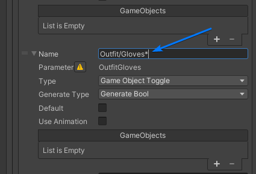

# ProfilesExtended

This mod allows you to extend the current profiles system (of the avatar parameters).

### Features:
1. Ignore parameters that have `*` in their name (not the parameter name in the animator, but the one in the AAS)
2. Force parameter changes by having `*` in the profile name



### Configuration:
You can **define your own tags**, for both parameters and profiles. To configure it install the mod, and run the
game at least one time so the configuration gets generated. After that you can go to (this might change if you
have the game installed somewhere else):

```console
C:\Program Files (x86)\Steam\steamapps\common\ChilloutVR\UserData\MelonPreferences.cfg
```

You can then edit and look for `[ProfilesExtended]` line, bellow it there should be all configurations with a little 
description. You **can** edit whether the game is running or not, they should take effect as soon as you save the file.

#### Example
```markdown
[ProfilesExtended]
# Which tags should be added to the AAS param name (not animator param name) so it isignored by the profile changes (default always overrides).
IgnoreTagParam = [ "*", "**", ]
# Which tags should be added to the profile name to force all params to change when chanted into.
ForceTagProfile = [ "*", "WOO", ]
```

---

## Disclosure

> ---
> ⚠️ **Notice!**  
>
> This mod's developer(s) and the mod itself, along with the respective mod loaders, have no affiliation with ABI!
>
> ---
