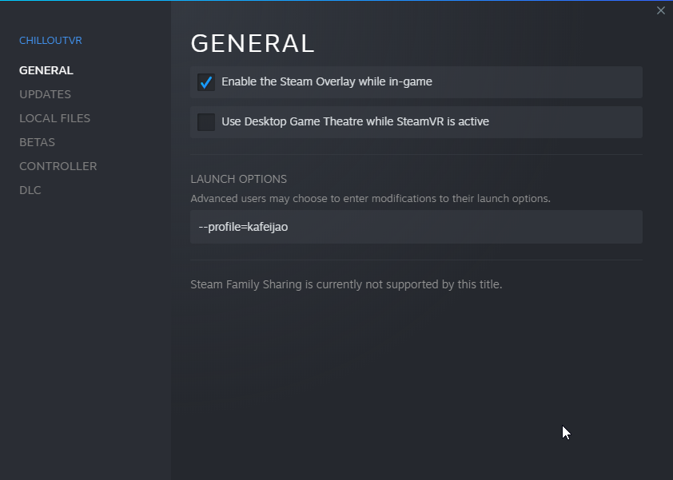

## Collection of ChilloutVR MelonLoader Mods

- [LoginProfiles](#loginprofiles)
- [PickupOverrides](#pickupoverrides)
- [CCK.Debugger](#cckdebugger)


### LoginProfiles
This mod allows to use an argument when starting ChilloutVR in order to select a login profile. This enables
swapping accounts without requiring to enter the credentials (if logged in on that profile previously). This is useful for me to deploy two clients on two different
accounts to test avatars and worlds synchronization stuff.

The syntax for the argument is `--profile=profile_id`. Where `profile_id` is whatever name you want the profile to be called.
It doesn't need to be the same as the username.

By default the game saves the credentials in the file `\ChilloutVR\ChilloutVR_Data\autologin.profile`. This mod modifies
the path to `\ChilloutVR\ChilloutVR_Data\autologin-profile_id.profile`.

**Note**: You will need to enter your credentials when using a profile for the first time, and from there on when using
that profile, it will re-use the profile credentials. To clear a profile you can either delete the corresponding `autologin-profile_id.profile` file,
or start the game with the profile you want to clear, and then use the in-game menu to logout (this also deletes the file).

#### Example using via steam:


#### Example using a bat file:
Create a `random_name_123.bat` file next to where `ChilloutVR.exe` file is, with the following contents:
```bat
ChilloutVR.exe --profile=kafeijao
```
Then all you need is double click that file and should open ChilloutVR with the respective profile.

### PickupOverrides
This mod allows to override certain pickup settings. Currently it only supports overriding the Auto-Hold settings.

With Auto-Hold set to `true` all pickups will stick to your hand once you grab them. To release you need to:
 - Press `G` on your keyboard (if playing in desktop)
 - Hold the `grip` while pulling the `thumbstick down` on your **right** controller (if playing in VR).

If the Auto-Hold is set to `false` the pickup will be released as soon as you stop holding it.

Currently the only way to change whether you want Auto-Hold or not is through Melon Config. The config is located at
`<game_folder>\UserData\MelonPreferences.cfg`. You can edit the config while the game and it will take effect as soon
as you save the config file.

### CCK.Debugger
This mod allows to debug content you upload to CVR, for now it allows debugging `Avatars` and `Props`. It does so by
creating a menu with a bunch information for the selected object. You can also use to debug your friend's content because
it allows to see the information about other people's avatars/props.

The menu will be attached to the left of your quick menu. There is a pin icon to fixate it in world space (this will also
prevent disappearing when you close the menu).

#### Avatar Menu Features
- Attributes
  - Avatar User Name
  - Avatar Name (partial avatar id for now)
- Synced Parameters
- Local Parameters (parameters prefixed with a `#`)
- Default Parameters (parameters that cvr populates, eg: `GestureLeft`)

#### Prop Menu Features
- Attributes
  - Prop Name (partial spawnable id for now)
  - User Name of the person that spawned it
  - Current person driving the sync (will be N/A when it's the local user)
  - Sync type (I attempted to make a half-ass mapping but requires more investigation)
- Synced Parameters
- Main Animator Parameters (all parameters (including the synced) from the animator on the root)
- Pickups (lists all pickups in the prop, and who's grabbing them)
- Attachments (lists all attachment scripts, and what they are attached to)

#### Menu


- The `orange` marked buttons allows swapping between the `avatars` and `props` debug menu.
- The `green` marked button allows you to pin the menu in world space, and it will make it so it doesn't close with the menu.
- The `deep pink` buttons allow you to iterate through avatars/props.

#### Todo
- [ ] Current playing animations by layer.
- [ ] `CVR Pointer`, `CVR Avanced Avatar Settings Trigger`, and `CVR Spawnable Trigger` debug.
- [ ] `Dynamic Bone` colliders and radius visualization.

## Disclosure

> ___
> ### ⚠️ **Notice!**
>
> This mod's developer(s) and the mod itself, along with the respective mod loaders, have no affiliation with ABI!
> ___