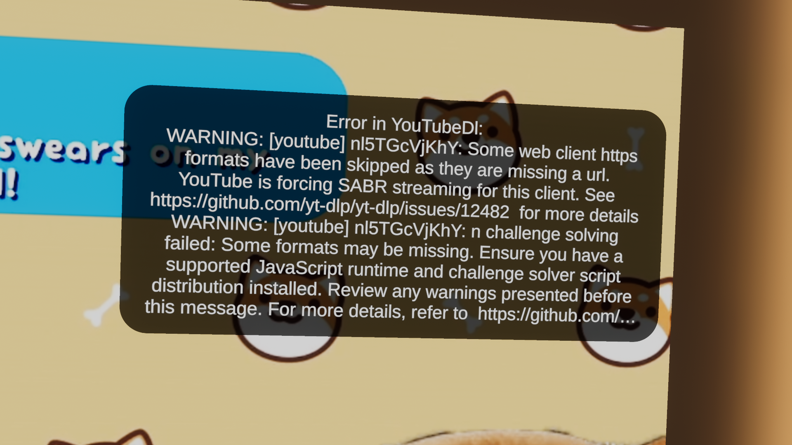

# YoutubeFixSABR

Fixes the SABR issue that causes youtube not loading in video players

Error this addresses:

## How it works

1. Downloads the latest deno.exe onto the `ChilloutVR\UserData\YoutubeFixSABR\deno.exe` folder. This follows the same
   download logic as the official deno installer https://deno.land/install.ps1 but we __exclude__ writing the Path env
   vars
2. Changes CVR's yt-dlp arguments:
   - Removes `--impersonate=Safari-15.3`
   - Removes `--extractor-arg "youtube:player_client=web"`
   - Adds `--js-runtimes "deno:<ChilloutVR\UserData\YoutubeFixSABR\deno.exe>"`
   - Adds `--extractor-args "youtube:player-client=default,-web_safari"`

I yoinked the fix from: <https://github.com/yt-dlp/yt-dlp/issues/15569#issuecomment-3756488415>

## Garbo quality
- Currently CVR filters out the good quality options, I'd need to investigate which formats shouldn't be filtered out
